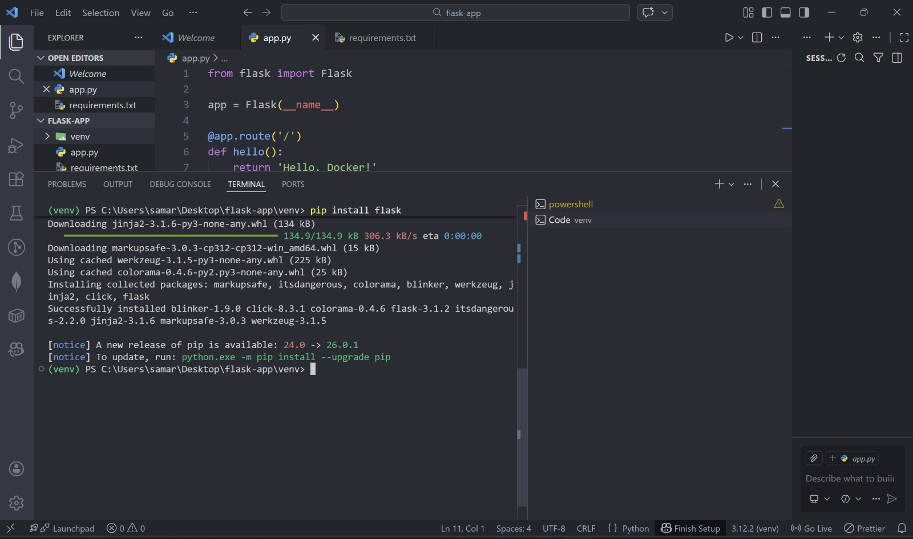
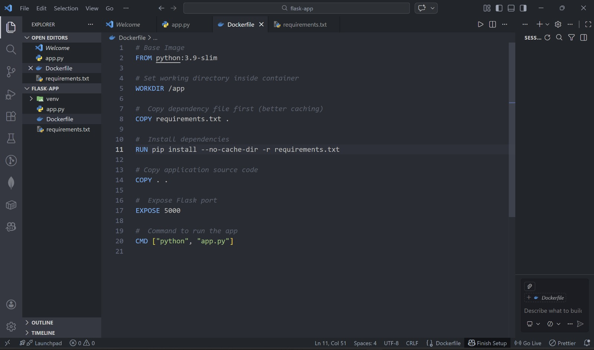
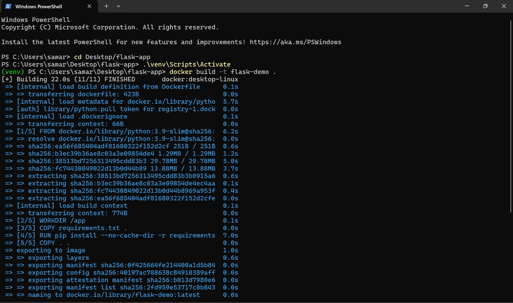
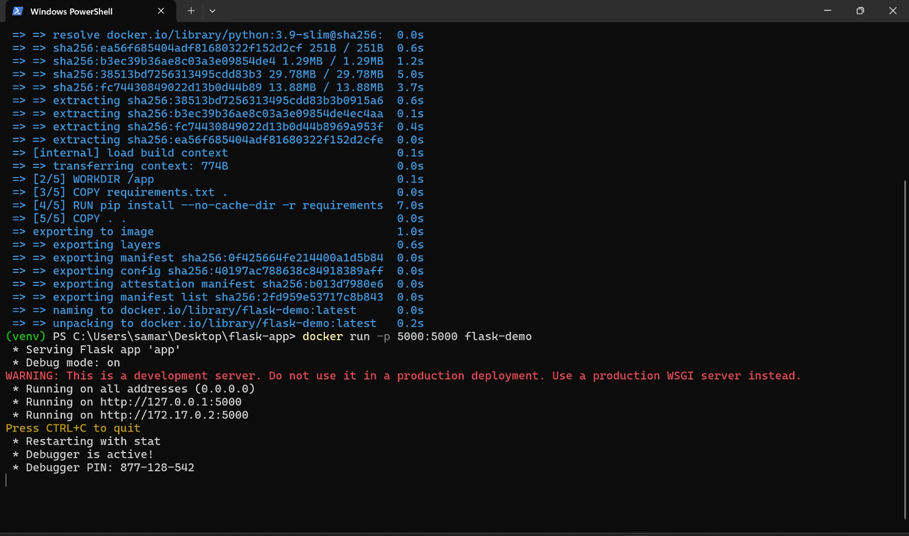

# Experiment: NGINX Deployment Using Different Base Images

## Objective
Deploy NGINX using different Docker base images and compare image size, layers, and usage.

## Part 1: Official NGINX Image
```
docker pull nginx:latest
docker run -d --name nginx-official -p 8080:80 nginx
curl http://localhost:8080
```

.png)

## Part 2: Ubuntu base Image

Dockerfile :
```
FROM ubuntu:22.04
   RUN apt-get update && \
      apt-get install -y nginx && \
      apt-get clean && \
      rm -rf /var/lib/apt/lists/*

  EXPOSE 80
  CMD ["nginx", "-g", "daemon off;"]
```

.png)

## Part 3: Alpine Base Image

Dockerfile :
```
FROM alpine:3.18

RUN apk update && apk add --no-cache nginx

EXPOSE 80
CMD ["nginx", "-g", "daemon off;"]
```
.png)

## Part 4: Image Size and layer Comparison
.png)

## Part 5: Using HTML and then cleanup
.png)

# Hosting Flask app on docker

## Create docker file

1. create separate folder
2. create a python program:



3. create docker file with commands:

```bash

FROM python:3.10-slim

WORKDIR /app

RUN pip install flask

COPY app.py .

EXPOSE 5000

CMD ["python", "app.py"]


```



---

## Build and run image

1. Build the image from the docker file

```bash
docker build -t flask-sapid-app .
```




2. Run the image:

```bash
docker run -d -p 8080:5000 flask-sapid-app:3.0
```



## Result

Python program running


